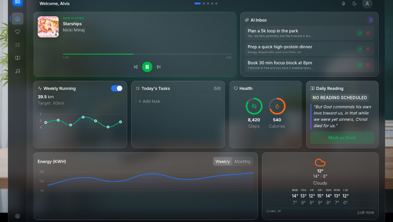
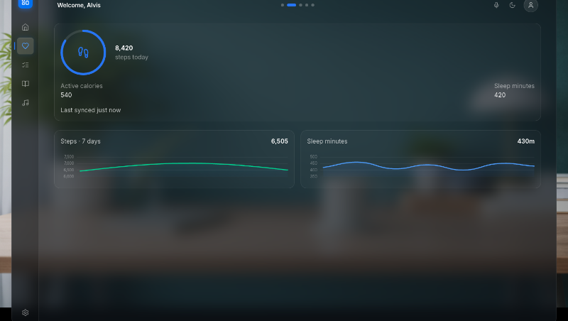

# Dashingly

A self-hosted personal dashboard for Raspberry Pi, desktop, or any local machine. Pulls together music, activity, tasks, weather, and AI suggestions in one place — all running locally, no cloud required.

Clone it, drop in your API keys, and it works.



---

## What's in it

**Spotify** — real-time now playing, album art, playback controls. Shows a clean empty state if nothing's connected.

**Health & Activity** — weekly running stats and step/calorie tracking via Strava. No Apple Health needed.

**Tasks** — today, upcoming, and completed. Simple.

**AI Suggestions** — generates suggestions on a schedule or on demand once you add an OpenAI key.

**Weather** — location-based via Open-Meteo, auto-refreshes, supports °C/°F.

**Voice activation** — wake word support to dismiss the screensaver hands-free.

---

## Screenshots

### Home


### Health



---

## Setup

```bash
git clone https://github.com/alvsabel/dashingly.git
cd dashingly
npm install
npm run dev
```

Open Settings → Integrations and add your keys for Spotify, Strava, and OpenAI. That's it — the dashboard populates with real data immediately.

No `.env` file editing. No fake placeholders. If a service isn't connected, its tile won't show.

---

## Build

```bash
npm run build               # current platform
npm run build:linux         # Linux x64
npm run build:linux-arm64   # Raspberry Pi
```

---

## Stack

Vue 3 · TypeScript · Vite · Electron · Tailwind CSS · better-sqlite3

Uses `vue-tsc` for type checking. Recommended IDE: VS Code + Volar.
